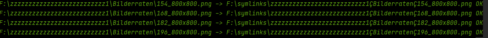
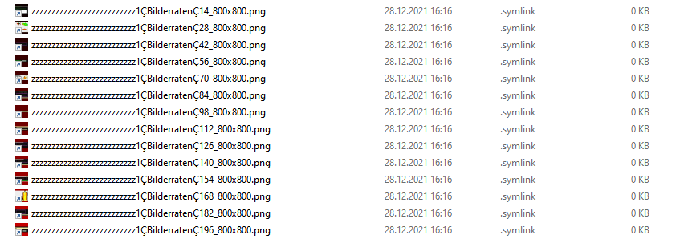
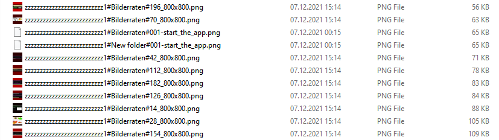
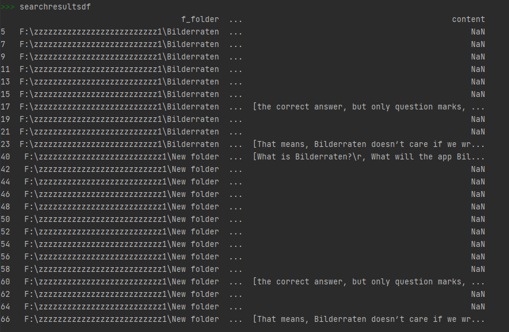
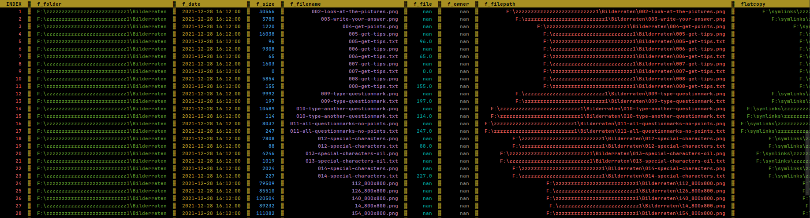
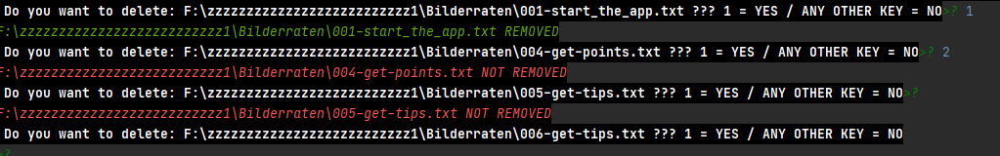

<p align="center"><a href="https://twitter.com/Aprender_alemao"></a><a href="https://www.facebook.com/estudaralemao/"></a><a href="https://www.instagram.com/estudaralemao/"></a><a href="https://www.youtube.com/c/wwwqueroestudaralemaocombr"></a><a href="https://api.whatsapp.com/send?phone=5511989782756&text=I%20want%20to%20know%20..."></a><a href="https://www.queroestudaralemao.com.br"></a><a href="https://br.pinterest.com/chucrutehans/"></a><a href="mailto:aulasparticularesdealemaosp@gmail.com?subject=I%20want%20to%20know%20...%20">
</a>


<p align="center">
<a href=https://github.com/hansalemaos></a>
<a href=https://www.queroestudaralemao.com.br></a>
<a href=#></a>
<a href=https://codeload.github.com/liangjingkanji/DrakeTyporaTheme/zip/refs/heads/master></a>
<a href=https://github.com/dmhendricks/signature-social-icons></a>
</p><br><!--  -->

# DirDF

Are you one of those people who have never any space on their hard disk? Do you spend hours and hours searching for your files because you never remember where you saved them? Well, since I am one of those, I tried several tools in the past: [TreeSize](https://www.jam-software.com/treesize_free) / [WinDirStat](https://windirstat.net/) / [WizTree](https://diskanalyzer.com/) / [SpaceSniffer](http://www.uderzo.it/main_products/space_sniffer/) / GREP. They all are great,

but take forever to get the job done and only offer limited filter functions. Around 5 hours ago, after having searched around 30 minutes for a file on my hard drive, I decided to do something about it. Since [pandas](https://github.com/pandas-dev/pandas) is the greatest invention of mankind (eighth wonder of the world?), I thought: why not using the power of pandas to solve this problem once and for all?

Now, about 5 hours later, the first version of “DirDF” is ready, and I am really happy with the results (I found the file I was looking for in a couple of seconds hahaha)

## how to use it
### Creating an instance
```
search_folder = DirDF(

    path_to_search=r"F:\\zzzzzzzzzzzzzzzzzzzzzzzzzz1", save_df_to=r"F:\\saveto"

)
```
**path_to_search** = you can pass a string or a list (more than one path)  
**save_df_to** = the search results will be saved in this folder so that you can use them later on

### Preparing flat copy
```
search_folder.create_flatcopy_link(separator="Ç", saveto=r"F:\\symlinks")
```

This function will create a column in the DataFrame with the filenames for “flat copy” (all files in one folder).  It will not copy anything yet!  
**separator="Ç"** means that the backslash ‘\\’ will be replaced by “Ç”. The replacement is important because there is not “flat copy” with a backslash in the path!

### Performing a flat copy (symlink)
```
search_folder.create_simlink_in_folder(filtered_df=search_folder.df, printresult=True)
```

Here we perform the “flat copy” that we prepared in the last command. Important: the files are not copied, only a symlink is created (to save space hahaha).





### Performing a flat copy (real copy)
```
search_folder.create_flatcopy_link(seperator="#", saveto=r"F:\\symlinks")
search_folder.flatcopyfiles(filtered_df=search_folder.df, printresult=True)
```
Here we perform the “flat copy” but this time, the files are copied!




### Regex search in file content
```
all_txt_files = search_folder.df.loc[search_folder.df.f_filepath.str.contains("\\.txt$")].copy() #**The filter functions of pandas are awesome! Let’s filter all txt files.**

**

searchresultsdf = search_folder.search_with_regex_in_files(

    regular_expression=r"[^\\n]+Bilderraten\[^\\n]+",

    df=all_txt_files,

    ignorecase=False,

    dotall=False,

    printresult=True,

    use_bs4=True

)

```

Here I perform a regex search in all TXT files. **If you don’t pass a filtered DataFrame, search_folder.df will be used. The results are returned as a DataFrame**



### DataFrame beaaaautifuuuuul 
```
search_folder.printdf(start=1, how_many_lines=1000)
```
A print function to make the DataFrame look more beautiful.



### Delete files
```
search_folder.delete_files(filtered_df=all_txt_files, printresult=True, ask_before=True)
```
This function will delete all files in the filtered DataFrame. **If you don’t pass a filtered DataFrame, search_folder.df will be used.** ***It will always ask before deleting a file, unless you pass “ask_before=False”***
